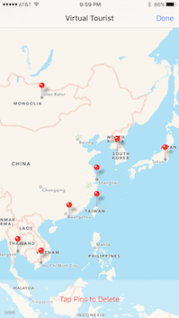

# Virtual Tourist

## Overview

- Multi-view Swift app allows the user to drop pins on a map and pull up Flickr images associated with that location
- Built in the Udacity course _iOS Persistence and Core Data_ and utilizes various data persistence techniques, including the storing of locations and images using Core Data

## Screenshots

## Instructions

In order for the networking calls to work correctly in the app, you will need to do the following:

Assign the API_KEY constant:

